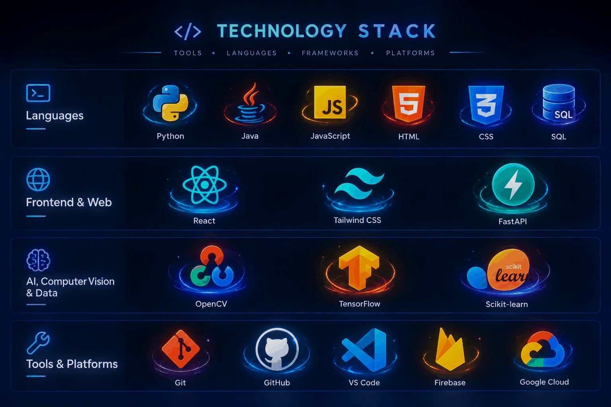

<div align="center">

<!-- ╔══════════════════════════════════════════════════════════════╗ -->

<!--                    ✦ PREMIUM PROFILE HEADER ✦                -->

<!-- ╚══════════════════════════════════════════════════════════════╝ -->


<br/>

<!-- ═════════════════════ ANIMATED IDENTITY ═════════════════════ -->

<a href="https://git.io/typing-svg">

</a>

<br/><br/>

<!-- ═════════════════════ PROFILE IDENTITY ═════════════════════ -->


<br/><br/>

<!-- ══════════════════════ CORE IDENTITY ═══════════════════════ -->

<table>
<tr>
<td align="center" width="100%">

### `SOURADIP.exe`

```text
┌──────────────────────────────────────────────────────────┐
│                                                          │
│   🧠  LEARNING        →        ⚙️  BUILDING              │
│                                                          │
│   💡  IDEAS           →        🚀  PRODUCTS              │
│                                                          │
│   🔍  PROBLEMS        →        ✨  SOLUTIONS              │
│                                                          │
└──────────────────────────────────────────────────────────┘
```

</td>
</tr>
</table>

<br/>


<!-- ═══════════════════════ FINAL STATEMENT ═══════════════════ -->


<br/><br/>

<!-- ===================== SINGLE LINE CONNECT SECTION ===================== -->

<div align="center">


<br/>

<a href="https://portfilonew-t7na.vercel.app/" target="_blank">

</a>
&nbsp;
<a href="https://www.linkedin.com/in/souradip-roy-chowdhury-410a90374?utm_source=share_via&utm_content=profile&utm_medium=member_android" target="_blank">

</a>
&nbsp;
<a href="https://github.com/souradipchowdhury-cpu" target="_blank">

</a>
&nbsp;
<a href="mailto:souradiproychowdhury@gmail.com">

</a>
&nbsp;


</div>

---


</div>

## 🧠 About Me

<div align="center">


<br>


</div>

<br>

<table>
<tr>
<td width="60%" valign="top">

### 👨‍💻 Who I Am

I'm a **Computer Science & Engineering student** passionate about building **intelligent, practical, and user-focused software**.

I enjoy transforming ideas into real-world products by combining **AI, modern web technologies, computer vision, voice interfaces, and automation**.

My goal is to create technology that is not only powerful, but also **simple, accessible, and enjoyable to use.**

</td>

<td width="40%" align="center">

```text
╭──────────────────────╮
│   ✦ DEVELOPER MODE   │
├──────────────────────┤
│                      │
│  AI          ████████ │
│  WEB         ███████  │
│  CV          ██████   │
│  VOICE       █████    │
│  BUILD       ████████ │
│                      │
╰──────────────────────╯
```

</td>
</tr>
</table>

<br>

<div align="center">

### ✦ Areas I'm Exploring


<br>


</div>

<br>

<div align="center">

### ⚙️ My Development Philosophy

<table>
<tr>
<td align="center">

**01**
💡 **Think**

<br>

Understand the problem

</td>

<td align="center">→</td>

<td align="center">

**02**
🧠 **Create**

<br>

Design the solution

</td>

<td align="center">→</td>

<td align="center">

**03**
⚡ **Build**

<br>

Turn ideas into products

</td>

<td align="center">→</td>

<td align="center">

**04**
🚀 **Improve**

<br>

Make it better

</td>
</tr>
</table>

</div>

<br>

<div align="center">


```yaml
print("name:Souradip Roy Chowdhury")
print("role: CSE Student | AI & Web Developer")
print("location: West Bengal, India")
print("graduation: 2028")

focus:
  - Conversational AI
  - Computer Vision
  - Web Applications
  - Voice Interfaces
achievement: Internal Hackathon Winner 2025
```

</td>
</tr>
</table>

> **"Building technology that feels intelligent, useful, and human-centered."**

---
</div>
## 🧰 Technology Stack

<div align="center">



</div>

</div>

---

## 🚀 Featured Projects

<div align="center">

<table>
<tr>
<td width="50%" valign="top">

<h3 align="center">🎙️ Questora</h3>
<p align="center"><b>AI-Powered Multilingual Voice Assistant</b></p>

An AI-powered assistant inspired by Gemini and ChatGPT that allows users to ask questions, receive intelligent answers, and interact through voice in multiple languages.

**Highlights**

- Conversational question answering
- Voice-based interaction
- Multilingual response support
- Interactive and accessible user experience

**Tech:** `React.js` `JavaScript` `AI APIs` `Speech Recognition`

<p align="center"><a href="https://github.com/souradiproychowdhury-cpu/questora">View Repository →</a></p>

</td>
<td width="50%" valign="top">

<h3 align="center">✈️ Wonder Goal</h3>
<p align="center"><b>Smart Travel Planning & Budgeting Web App</b></p>

A travel planning and budgeting application designed to make trip planning simple, affordable, and personalized by combining itinerary planning with intelligent budget management.

**Highlights**

- Personalized itinerary planning
- Intelligent budget allocation
- Travel expense organization
- Simple and responsive planning experience

**Tech:** `React.js` `JavaScript` `Web APIs` `Tailwind CSS`

<p align="center"><a href="https://github.com/souradiproychowdhury-cpu/wonder-goal">View Repository →</a></p>

</td>
</tr>

<tr>
<td width="50%" valign="top">

<h3 align="center">🖐️ Gesture Control Suite</h3>
<p align="center"><b>Touchless Computer Vision Controller</b></p>

A touchless computer interaction system that uses computer vision to recognize hand gestures and translate them into software commands.

**Highlights**

- Hand landmark tracking
- Gesture-to-command mapping
- Touchless interaction
- Real-time computer vision processing

**Tech:** `Python` `OpenCV` `MediaPipe` `NumPy`

<p align="center"><a href="https://github.com/souradiproychowdhury-cpu/gesture-control">View Repository →</a></p>

</td>
<td width="50%" valign="top">

<h3 align="center">🎓 MOCHI</h3>
<p align="center"><b>AI Academic Assignment Assistant</b></p>

An AI assignment assistant designed to understand academic questions and provide structured, easy-to-follow responses.

**Highlights**

- Academic query understanding
- NLP-based response pipeline
- Step-by-step explanations
- Interactive study assistance

**Tech:** `Python` `NLP` `AI/ML`

<p align="center"><a href="https://github.com/souradiproychowdhury-cpu/mochi-ai-assistant">View Repository →</a></p>

</td>
</tr>

<tr>
<td width="50%" valign="top">

<h3 align="center">🩺 Smart Health Monitoring</h3>

A health-monitoring web application concept focused on organizing health information through a responsive interface and data-processing logic.

**Tech:** `Python` `React.js` `HTML` `CSS`

</td>
<td width="50%" valign="top">

<h3 align="center">💬 Conversational Chatbot</h3>

A context-aware chatbot with a web interface, designed to support interactive conversations and structured dialogue management.

**Tech:** `Python` `NLP` `HTML` `CSS`

</td>
</tr>
</table>

</div>

---

## 📊 GitHub Analytics

<div align="center">


<br/>


</div>

---

## 🏆 Certifications & Achievements

- 🥇 **Internal Hackathon Winner — 2025** — Recognized for rapid prototyping and innovative problem-solving.
- 📜 **Python for Everybody** — Coursera / University of Michigan.
- 🌐 **Web Development Mastery** — HTML, CSS & JavaScript.

---

## 🌍 Languages

`Bengali — Native` · `English — Proficient`

---

## 🤝 Let's Connect

<div align="center">

I am open to collaborating on **AI applications, web development projects, open-source ideas, and innovative student-led solutions**.

<!-- Portfolio Button -->

<a href="https://portfilonew-t7na.vercel.app/" target="_blank">

</a>

<br/><br/>

<a href="mailto:souradiproychowdhury@gmail.com">

</a>
<a href="https://linkedin.com/in/souradip-rc">

</a>
<a href="https://github.com/souradiproychowdhury-cpu">

</a>

<br/><br/>

<!-- Animated Footer -->


<sub>Designed with curiosity, built with code, and improved through continuous learning.</sub>

</div>
